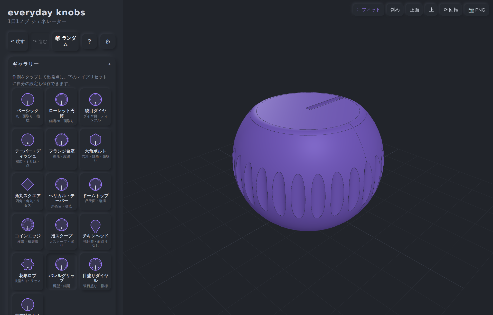

# everyday-knobs（1日1ノブ）🎛️

ロータリーエンコーダ（ALPS **EC1110120005** / **EC12E085**）に挿さるツマミを、
ブラウザ上で**パラメトリックに生成・プレビュー・STL/STEP エクスポート**するジェネレーター。
サーバー不要のクライアントオンリー（Vite + React + TypeScript + Replicad/WASM + Three.js）。



> 「**1日1ノブ**」— ジェネレーターに機能を1日1つ足し、その日の機能で作例ノブを1つ出し、
> X（#まいにちのぶ）に1投稿する。30日でひと区切りまで育てた記録が
> [`docs/devlog.md`](docs/devlog.md) と [`posts/`](posts/) にあります。

---

## できること

トグルとスライダーで全パラメータ（約30種）を操作 → 3Dプレビューがほぼ即時更新 →
**STL / STEP** で書き出し。重いテクスチャは「操作中は滑面の下書き → 静止後に仕上げ」の
2段ビルドで快適に動きます。

### 形づくり
- **対象軸**：EC11（φ6 Dカット）/ EC12E（φ6 中空）をトグルで切替。軸穴の実寸表示つき
- **本体断面**：丸 / 多角形（3〜8角・角丸）/ 波型（ロブ）/ 指針（チキンヘッド）
- **側面プロファイル**：直胴 / テーパー / **樽・くびれ**（回転体）
- **天面**：面取り（チャンファ/フィレット）＋ リセス / すり鉢（ディッシュ）/ **ドーム（凸）**
- **側面テクスチャ**：縦溝・斜め（ヘリカル）・綾目（ダイヤ）・横溝（リング）・指スクープ
- **スカート**：裾のフランジ段
- **指標**：刻線ポインター / ディンプル（角度・長さ・深さ）
- **目盛り**：天面ロータリースケール（全周 / 弧・主目盛り）

### 印刷・実用
- 嵌合クリアランス **0.05mm刻み＋マイナス公差（圧入）**、軸穴の実寸（φ / Dカット面）表示
- **公差テストピース**STL（0.05刻み5段・刻み目で識別）で一発ベストフィット
- 軸穴入口の挿入リードイン面取り、底面のエレファントフット対策面取り

### データ・共有
- **STL / STEP** 書き出し、ビューの **PNG** 保存
- **URL共有**（設定をハッシュに同期）、**JSON 保存/読込**、メーカー向け**注文コード**
- **作例プリセット16種**＋**マイプリセット**（ブラウザ保存）

### UI / 操作性
- カテゴリ別アコーディオン（閉じても現在値サマリ表示）、レスポンシブ／モバイル対応
- **Neumorphism UI**・**ライト/ダークテーマ**・**アクセントカラー自由変更**（UI＋3Dノブ連動）
- **Undo/Redo**、**🎲ランダム**、キーボードショートカット、初回オンボーディング、a11y配慮

> 機能ごとの実装メモと#まいにちのぶ投稿は [`docs/devlog.md`](docs/devlog.md) /
> [`posts/まいにちのぶ.md`](posts/まいにちのぶ.md) に全Day分。

| 綾目ダイヤ | 花形ロブ | チキンヘッド | ドーム天面 |
|---|---|---|---|
|  |  |  |  |

---

## クイックスタート

前提：**Node.js 20+**（22で確認）。アプリ本体は [`app/`](app/)。

```bash
cd app
npm install      # 依存取得（初回。opencascade WASM 約11MB を含む）
npm run dev      # 開発サーバ → http://localhost:5173
npm run build    # 型チェック＋本番ビルド（dist/ に静的出力）
npm run preview  # 本番ビルドのローカル確認
```

初回プレビューは OpenCASCADE(WASM) の初期化で数秒かかります（以降は高速）。ビルド成果物は
静的ファイルのみなので、そのまま静的ホスティング（GitHub Pages / Vercel 等）に載ります（`base: "./"`）。

---

## 技術スタック

| 領域 | 採用 | 理由 |
|---|---|---|
| 言語 | TypeScript | Webネイティブ・保守しやすい |
| CADカーネル | **Replicad**（opencascade.js / WASM） | B-repソリッドを扱え、**STEPを本物の形式で出力可能** |
| 3D表示 | Three.js | プレビュー描画・カメラ操作・PNG書き出し |
| UI | React | パラメータパネル・テーマ・オーバーレイ |
| 計算分離 | WebWorker（comlink） | カーネル計算をUIスレッドから分離し、操作中も固まらせない |
| ビルド | Vite | WASM / Worker 構成と相性が良い |
| エクスポート | STL（メッシュ）/ STEP（B-rep） | Replicad標準機能 |

**なぜReplicad**：STEP は B-rep（本物のソリッド）で、メッシュ系からは綺麗に出せない。
STEP を扱うには OpenCASCADE カーネルが必須で、それをブラウザ・サーバーレスで使える
ほぼ唯一の選択肢が Replicad。

### ソース構成

```
app/src/
├── cad/
│   ├── params.ts          … 全パラメータ型・軸スペック・可動域算出・clampParams（値の正規化）
│   ├── knob.ts            … ノブ本体＋全フィーチャ＋軸穴の生成（Replicad）
│   ├── presets.ts         … 作例プリセット16種、random.ts … ランダム生成
│   ├── config.ts          … JSON/注文コードの直列化、myPresets.ts … ローカル保存
│   ├── useKnobMesh.ts     … 2段ビルド・コアレッシングのスケジューラ
│   ├── useUndoableParams.ts … Undo/Redo 履歴
│   └── cadClient.ts       … ワーカーを comlink でラップした型付きクライアント
├── worker/cad.worker.ts   … OpenCASCADE 初期化・build/mesh・STL/STEP・公差テストピース
├── viewer/Viewer.tsx      … Three.js プレビュー・カメラ操作・テーマ/アクセント追従
├── ui/
│   ├── Controls.tsx       … アコーディオンのパラメータパネル
│   ├── PresetGallery.tsx  … パラメータ駆動のSVGグリフ付きギャラリー
│   ├── AppearanceMenu.tsx … テーマ＋アクセントカラー、HelpOverlay.tsx … 初回ガイド/ショートカット
├── useTheme.ts / useAccent.ts … テーマ・アクセント色（CSS変数）
└── App.tsx                … 状態管理・キーボード・URL同期
```

---

## 対象エンコーダ（寸法の正）

実在の2機種を直接の対象とする。**軸インターフェースが本質的に異なる**（ソリッド軸 vs 中空軸）
ため、軸モジュールの差し替え設計を実物で検証できる。一次資料（3D PDF / STEP / プレビュー）は
[`reference/`](reference/)。

| 機種 | 軸タイプ | ノブ側の嵌合 |
|---|---|---|
| **EC1110120005**（EC11 金属軸） | φ6 Dカット（二面幅4.5mm / フラット面は軸心から1.5mm） | 軸に被せる穴 |
| **EC12E085**（EC12E） | φ6.05 中空（インサート）軸 | 外周に被せる |

軸寸法は ALPS 配布 STEP（インチ単位）から実測（mm はインチ×25.4 換算）。嵌合クリアランスは
独立パラメータで、最終公差は**公差テストピース**の試し刷りで詰める。詳細表は
[`reference/README.md`](reference/README.md) と [`docs/devlog.md`](docs/devlog.md) Day14。

---

## 30日の歩み

- **Day 1–7**：MVP → 天面エッジ・テーパー・凹み天面・指標・縦溝・微調整パラメータ
- **Day 8–15**：JSON/注文コード・スカート・斜め/綾目ローレット・多角形・**性能改善**・
  ギャラリー・印刷実用化・目盛り
- **Day 16–20（形状バリエ週）**：樽/くびれ・ロブ断面・チキンヘッド・横溝/スクープ・ドーム天面
- **Day 21–26（UX週）**：アコーディオン・モバイル・ビューワ強化・Undo/ランダム・URL/マイプリセット・
  **Neumorphism＋テーマ＋アクセント色**
- **Day 27–30（仕上げ）**：ヘルプ＆a11y・オンボーディング/ショートカット・総合QA・完結

全Day の詳細は [`docs/devlog.md`](docs/devlog.md)、投稿アーカイブ（絵文字付き）は
[`posts/まいにちのぶ.md`](posts/まいにちのぶ.md)。

---

## リポジトリ構成

```
everyday-knobs/
├── README.md              … このファイル
├── CLAUDE.md              … 開発ガイド＆「1日1ノブ」作業手順
├── app/                   … ジェネレーター本体（Vite + React + TS + Replicad）
├── docs/
│   ├── devlog.md          … #まいにちのぶ 開発ログ（全Day）
│   ├── requirements_v1.md … 要件定義書 v1
│   └── img/               … README用スクリーンショット
├── posts/                 … #まいにちのぶ 投稿アーカイブ（本文＋キャプチャ）
└── reference/             … 対象エンコーダの実測寸法＋外観プレビュー
```

---

## ライセンス・クレジット

- **コード**：[MIT License](LICENSE)（© 2026 penomo / dotting dots）。自由に利用・改変・再配布可（著作権表示は保持）。
- **生成物**：このツールで書き出した STL / STEP は**あなたのもの**。商用利用も含め自由に使えます。
- **対象エンコーダ**：EC11 / EC12E はアルプスアルパイン社の製品です。寸法は同社公式 CAD を解析した
  実測値で、**メーカー配布 CAD（STEP/PDF）は再配布の懸念を避け本リポジトリには同梱していません**
  （[`reference/`](reference/) 参照、原データは ALPS 公式ページから入手）。
- **依存**：[Replicad](https://replicad.xyz/)（OpenCASCADE/WASM）・[Three.js](https://threejs.org/)・
  [React](https://react.dev/)・[Vite](https://vitejs.dev/)（各ライセンスに従う）。
- **作者**：penomo（[@penomo](https://x.com/penomo)） — #まいにちのぶ
