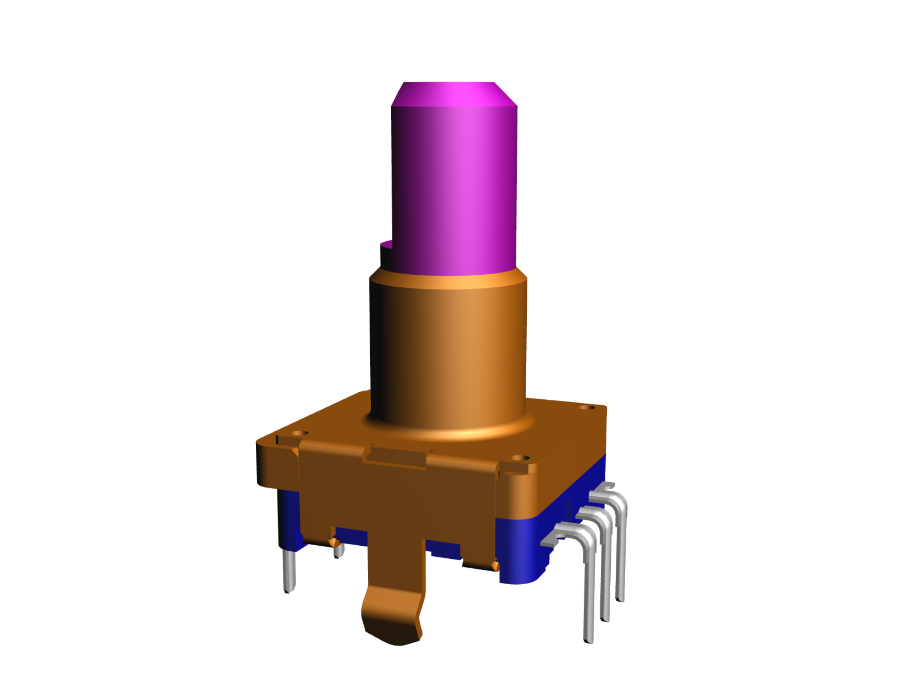
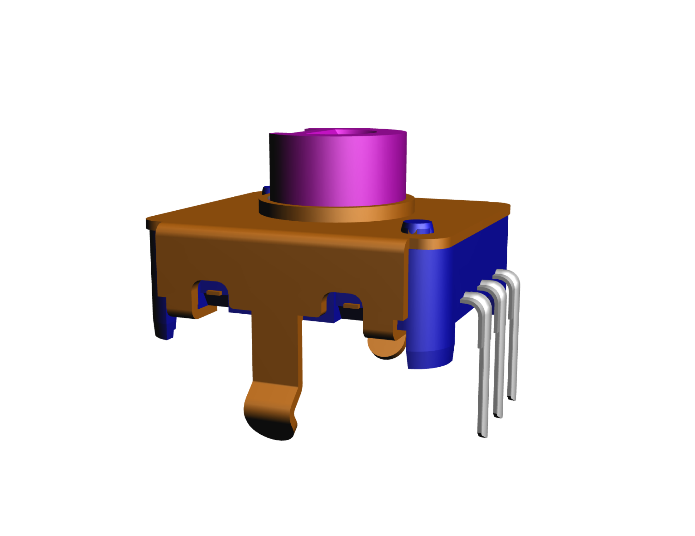

# everyday-knobs（1日1ノブ）

ロータリーエンコーダに挿さるツマミ（ノブ）を、ブラウザ上でパラメトリックに
**生成・プレビュー・エクスポート**するジェネレーター。トグルとスライダーで
全パラメータを操作し、3Dプレビューがリアルタイムに更新され、**STL / STEP** で
書き出せる。

「**1日1ノブ**」として、ジェネレーターに機能を1日1つ足しながら、その日の機能で
作例ノブを1つ出す。機能追加と作例制作を両輪で回し、ツール自体を育てていく。

まずは自分 / dotting dots 用の制作ツールとして始めるが、そのまま公開アプリへ
移行できる構造（**サーバー不要・クライアントオンリー**）で作る。

---

## ゴール / 非ゴール

### ゴール
- 対象エンコーダの軸穴（ネガ形状）を、トグルで切り替えてパラメトリック生成できる
- 基本本体形状を全パラメータ自由に調整でき、変更がリアルタイムにプレビュー反映される
- **STL と STEP の両方**でエクスポートできる
- 毎日1機能ずつ足せる、要素分解された拡張しやすいアーキテクチャ
- 将来の公開（静的ホスティング）を犠牲にしない設計

### 非ゴール（v1ではやらない）
- 3Dプリントの嵌合・公差の作り込み（※「クリアランス」パラメータの差し込み口だけ用意）
- 公開・共有機能（ギャラリー / URL共有 など）
- 対象外の軸規格（※軸モジュールは差し替え可能に作る）
- アセンブリ / 複数部品（v1は単一ノブのみ）

詳細は [`docs/requirements_v1.md`](docs/requirements_v1.md) を参照。

---

## 対象エンコーダ（★仕様変更あり）

要件定義 v1 では対象を「**EC11 のφ6軸3種（セレーション / 平軸 / 溝軸）**」と
していましたが、**実在する次の2機種を直接の対象**とするよう仕様変更しました。

| 機種 | シリーズ | 軸タイプ | ノブ側の嵌合 | メーカーページ |
|---|---|---|---|---|
| **EC1110120005** | EC11（金属軸） | **φ6 ソリッド軸** | 軸に被せる穴 | [リンク](https://tech.alpsalpine.com/j/products/detail/EC1110120005/) |
| **EC12E085** | EC12E | **中空 / インサート軸** | 外周 φ6 に被せる | [リンク](https://tech.alpsalpine.com/j/products/category/encorders/sub/02/series/ec12e/) |

この2機種は**軸インターフェースが本質的に異なる**（ソリッド軸 vs 中空軸）ため、
要件定義が掲げる「軸モジュールを差し替え可能に作る」設計方針を、抽象的な3種ではなく
**実物2種で最初から検証できる**良いケースになる。一次資料（3D PDF / STEP / プレビュー）は
[`reference/`](reference/) に保管。

| EC1110120005（EC11・φ6 ソリッド軸 / Dカット） | EC12E085（EC12E・中空シャフト） |
|---|---|
|  |  |

### 軸の確定寸法（STEP実測）

ALPS配布 STEP（両機種とも **SolidWorks 由来・単位はインチ**）を解析し、頂点・円筒面・
平面の配置から軸寸法を読み取った（**mm はインチ×25.4 換算**）。ノブ側の軸穴（ネガ形状）は
この値を基準に設計する。**嵌合クリアランスは独立パラメータ**として外に出し、最終公差は
実物のノギス実測＋試し刷りで詰める。

**EC1110120005（EC11 金属軸）**

| 項目 | 実測値 | 備考 |
|---|---|---|
| 軸径 | **φ6.0**（円筒面 r=3.0） | EC11 標準のφ6軸 |
| 軸断面 | **Dカット（片面フラット）** | フラット面は軸心から **1.5mm** → **二面幅 4.5mm**（ALPS標準のφ6平軸に一致） |
| フラット範囲 | 軸先端側 約8mm | 根元側 約7mm は全周φ6、先端に面取り |
| 軸の突出長 | **約15mm**（取付面〜先端） | 根元に φ7 段付き／ボス |
| 本体・ボス | 本体 約13mm角、ボス φ10〜φ11 | 取付・干渉確認用 |
| 全高 | 約23.5mm（端子先端〜軸先端） | STEP Z範囲 −3.5〜20 |

**EC12E085（EC12E 中空／インサート軸）**

| 項目 | 実測値 | 備考 |
|---|---|---|
| 軸形式 | **中空（インサート）シャフト** | 軸中心に貫通ボア |
| 外径 | **φ6.05**（円筒面 r=3.025） | ノブが被さる外周 |
| 内径（ボア） | **φ3.0**（円筒面 r=1.5） | 中空部 |
| 軸断面 | キー／フラット付きプロファイル | 複数のフラット面を検出。詳細キー形状はデータシート図面と要突き合わせ |
| 本体ボス | φ10（φ7.6 段付き） | |
| 軸の突出長 | 約6.5mm（ボス上面〜軸先端） | |
| 全高 | 約12mm | STEP Z範囲 −3.5〜8.45 |

> 注：上表は STEP からの読み取り値（概算を含む）。**嵌合に効く微小公差**と EC12E085 の
> キー形状の最終確定は、データシート寸法図とノギス実測で突き合わせる（「1日1ノブ」の
> 軸モジュール作り込みの日に実施）。詳細は [`reference/README.md`](reference/README.md)。

---

## 技術スタック

| 領域 | 採用 | 理由 |
|---|---|---|
| 言語 | TypeScript | Webネイティブ・保守しやすい |
| CADカーネル | **Replicad**（opencascade.js / WASM） | B-repソリッドを扱え、**STEPを本物の形式で出力可能** |
| 3D表示 | Three.js（Replicadヘルパー経由） | プレビュー描画 |
| UI | React | トグル・スライダーのパラメータパネル |
| 計算分離 | WebWorker | カーネル計算をUIスレッドから分離し、操作中も固まらせない |
| ビルド | Vite | WASM / Worker 構成と相性が良い |
| エクスポート | STL（メッシュ）/ STEP（B-rep） | Replicad標準機能 |
| 将来ホスティング | 静的（GitHub Pages / Vercel等） | サーバー不要 |

**なぜReplicad**：STEPは B-rep（本物のソリッド）フォーマットで、メッシュ系からは綺麗に
出せない。STEPを扱うには OpenCASCADE カーネルが必須で、それをブラウザ・サーバーレスで
使えるほぼ唯一の選択肢が Replicad。

---

## セットアップ / 開発

前提：**Node.js 20+**（22 で動作確認）と **npm**。すべてクライアントサイドで動くため
バックエンドやDBは不要。アプリ本体は [`app/`](app/) にある（Vite + React + TS + Replicad）。

```bash
cd app
npm install     # 依存取得（初回。opencascade WASM 約11MB を含む）
npm run dev      # 開発サーバ（http://localhost:5173）
npm run build    # 型チェック＋本番ビルド（dist/ に静的出力）
npm run preview  # 本番ビルドのローカル確認
```

構成の要点：

- **CAD計算は WebWorker**（[`src/worker/cad.worker.ts`](app/src/worker/cad.worker.ts)）に隔離。
  OpenCASCADE(WASM) をワーカー内で初期化し、comlink 経由でメインスレッドと通信 → 操作中も
  UIが固まらない
- プレビューは **Three.js**（[`src/viewer/Viewer.tsx`](app/src/viewer/Viewer.tsx)）。ワーカーが
  返すメッシュを `BufferGeometry` に流し込む
- ビルド成果物は静的ファイルのみ → GitHub Pages / Vercel にそのまま載る（`base: "./"`）

### アプリのソース構成

```
app/src/
├── cad/
│   ├── params.ts       … パラメータ型・エンコーダ軸スペック・可動域の算出
│   ├── knob.ts         … ノブ本体＋軸穴（ネガ形状）の生成（Replicad）
│   └── cadClient.ts    … ワーカーを comlink でラップした型付きクライアント
├── worker/
│   └── cad.worker.ts   … OpenCASCADE 初期化・build/mesh・STL/STEP エクスポート
├── viewer/Viewer.tsx   … Three.js プレビュー
├── ui/Controls.tsx     … トグル・スライダー・エクスポートUI
└── App.tsx             … 状態管理＋デバウンス再生成
```

### リファレンス資料

対象エンコーダの寸法・形状の「正」は [`reference/`](reference/) にある STEP / 3D PDF。
軸穴（ネガ形状）の寸法はここを基準にする（上の「軸の確定寸法」表を参照）。

---

## 現在地とロードマップ

### いま（Day 0 / 土台整備）
- [x] 要件定義 v1 を取り込み（[`docs/requirements_v1.md`](docs/requirements_v1.md)）
- [x] 対象を2機種（EC1110120005 / EC12E085）に仕様変更
- [x] 一次資料（3D PDF / STEP / 利用上の注意）を [`reference/`](reference/) に格納
- [x] 両機種の軸寸法を STEP から実測（上表）。残るは公差の最終確定
- [x] アプリ雛形（Replicad + Three.js + React + WebWorker + Vite）を [`app/`](app/) に構築

### Day 1（MVP）受け入れ基準
- [x] ブラウザでプレビューが表示される（Three.js + ワーカー）
- [x] 軸タイプをトグルで切り替えると軸穴形状が切り替わる（EC11 Dカット ⇄ EC12E 丸）
- [x] 円柱本体の径・高さをスライダーで変えるとリアルタイム更新される
- [x] 破綻パラメータ（軸穴 ≥ 本体径 等）がスライダー可動域で防がれる（最小肉厚を確保）
- [x] STL と STEP を書き出せる（ヘッドレス検証で STEP の妥当性を確認済み）

> 検証メモ：`npm run build`（型チェック＋バンドル）通過。CADパイプライン（boolean cut /
> STL / STEP）はヘッドレスで両軸タイプとも成功し、STEP は `ISO-10303-21` ヘッダ付きの
> 正規ファイルを確認。実機ブラウザでの目視確認は未実施（次の機会に）。

### 「1日1ノブ」機能追加の種
軸モジュールの公差パラメータ化 / 本体形状の追加（円錐台→樽型→多角形）/
表面処理（ローレット→フルート→ディンプル→刻み）/ 天面（ドーム→凹み→ポインター→ノッチ）/
スカート・フランジ / フィレット・面取り / パラメータのJSON保存・呼び出し /
嵌合クリアランス→実印刷で挿さる検証 /（以降）公開・ギャラリー・URL共有

---

## リポジトリ構成

```
everyday-knobs/
├── README.md                 … このファイル（プロジェクトの方針・ゴール）
├── app/                      … ジェネレーター本体（Vite + React + TS + Replicad）
├── docs/
│   └── requirements_v1.md    … 要件定義書 v1
└── reference/                … 対象エンコーダの一次資料（寸法・形状の「正」）
    ├── README.md             … リファレンスの索引・出典・注意事項
    ├── alps-usage-notice.rtf … ALPS配布CAD同梱の利用上の注意
    └── encoders/
        ├── EC1110120005/     … 3D PDF・STEP（インチ単位）・プレビュー
        └── EC12E085/         … 3D PDF・STEP（インチ単位）・プレビュー
```

## 未決事項（Open Questions）
- 嵌合に効く微小公差の最終確定（STEP実測値をノギスで突き合わせ）
- EC12E085 の中空シャフト断面（キー／フラット）の正確な形状
- 本体形状の初期プリミティブ（Day1は円柱のみで良いか）
- バリデーション方式（スライダー可動域を動的に絞る / 入力後に警告）
- 印刷素材の前提・公開時のライセンス方針
